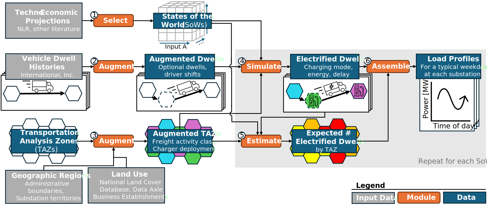

# LAUREL: Location-Attuned Uncertainty-Robust Electric-vehicle Load-simulator

This repository implements the LAUREL model described in:

> Passow, F. H., & Rajagopal, R. (2026). Prioritizing uncertainty-robust indicators to inform proactive substation upgrades for charging electric heavy-duty trucks. *Applied Energy* (submitted March 2026).

The specific use of the LAUREL model demonstrated here estimates e-HDT charging load profiles for each of the ~52,000 electrical substations in the continental U.S. across 1024 plausible future states of the world (SoWs) representing 2035 conditions. It identifies which substations grid operators should consider proactively upgrading for e-HDT charging, and what techno-economic indicators signal when such an upgrade may become necessary — findings that are assessed for robustness to uncertainty across all 1024 SoWs.

---

## Table of Contents

- [Background](#background)
- [Model Overview](#model-overview)
- [Input Data](#input-data)
- [Repository Structure](#repository-structure)
- [Prerequisites](#prerequisites)
- [Installation](#installation)
- [Running the Model](#running-the-model)
- [Scenarios](#scenarios)
- [Configuration](#configuration)
- [Output Data](#output-data)
- [HPC Execution (Sherlock)](#hpc-execution-sherlock)
- [Development](#development)
- [Citation](#citation)

---

## Background

Electric heavy-duty trucks (e-HDTs) will require geographically concentrated, high-power charging that will stress electric distribution infrastructure — particularly substations, which can take years and millions of dollars to upgrade. This model was built to answer: *which substations should grid operators proactively upgrade, and what observable conditions should trigger that decision?*

Our approach uses a continent-scale telematics dataset of ~69,000 diesel HDTs (International, Inc., April–November 2023) as the behavioral foundation. We simulate electrified versions of these vehicles across 1024 quasi-random combinations of key uncertain parameters (adoption rates, energy consumption, charger power, battery reserve). For each combination, we assemble 30-minute load profiles for every substation in the continental U.S. Findings are assessed for robustness across the full ensemble.

Key findings:

- The share of substations that would exceed 3 MW from e-HDT charging alone by 2035 ranges from 0.6% under a "used-and-useful-robust" policy (20th-percentile peak load) to 12.8% under a "duty-to-serve-robust" policy (80th-percentile peak load).
- Presence of a truck stop is the strongest geographic predictor of upgrade need; manufacturing and wholesaling land use are also influential. Almost no substations exceed 3 MW at adoption rates below 5%.
- The priority ordering of techno-economic indicators depends on local infrastructure: short-haul adoption rate is the leading indicator universally; for substations serving truck stops, truck-stop charger power is the second most important indicator; for all other substations, charging management strategy takes second place.

---

## Model Overview

The model has six modules that map to Kedro pipelines (see circled numbers in the following figure):



### Module 1 — Select States of the World (`prepare_totals`, `build_scenarios`)

Selects a set of plausible states of the world (SoWs) to evaluate, generating 1024 quasi-random combinations using Sobol' sequences (via OpenTURNS). Adoption rates by vehicle primary operating distance class are drawn from Beta distributions fit to NLR scenarios via a Gaussian copula. Other parameters (energy consumption rate, charger power at truck stops / depots / destinations, battery reserve) are sampled uniformly.

### Module 2 — Augment Dwell Data (`describe_dwells`, `compute_routes`)

Augments vehicle dwell history data with optional dwells and with marked driver shifts. Coalesces spurious short dwells, marks driver shifts (≥6.9 hr breaks per FMCSA rules), and inserts optional dwells at truck stops along shortest-path routes computed by GraphHopper. Optional dwells are inserted between existing dwells separated by >50 miles, if a truck stop falls within 1 mile of the shortest path. This grew our dwell count by ~35%.

### Module 3 — Augment TAZs (`describe_locations`)

Splits the continental U.S. into transportation analysis zones (TAZs) — H3 resolution-8 hexagons (~1/4-mile diameter) — and augments each with a freight activity classification and charger deployment. Classifies each TAZ into one of 22 freight activity classes:

- Undeveloped / No establishments / No freight-intensive establishments / Truck stops
- 18 K-Means clusters of freight-intensive TAZs (based on NAICS employee counts)

Deploys chargers by freight activity class: truck-stop charging at truck-stop TAZs, destination charging at freight-intensive TAZs, depot charging per-vehicle based on a 30-day rolling dwell-time threshold.

### Module 4 — Simulate Electrified Dwells (`electrify_trips`)

Simulates the e-HDT charging choices each vehicle in our dataset might have made, using a utility-maximization algorithm (inspired by Liu et al. 2022). The algorithm selects charging mode and energy amount at each dwell, trading off SoC maintenance against incurred delay, with look-ahead to the end of the current driver shift. Uses Numba JIT compilation for performance. Each SoW runs in ~25 minutes on a 4-core/64 GB machine.

### Module 5 — Estimate Expected Electrified Dwells (`evaluate_impacts`)

Estimates the total number of electrified dwells expected in each TAZ, using the freight activity class. Fuses SoW adoption rates (from Module 1) with freight-activity-class-specific vehicle visit statistics from the observed data. Uses logistic regression with a numeric correction term to ensure consistency with known fleet-level adoption rates.

### Module 6 — Assemble Load Profiles (`evaluate_impacts`)

Assembles charging load profiles for each substation from the simulated e-HDT vehicle histories by aggregating load profiles from the TAZs within each substation's territory. Bootstrap-samples electrified dwells (100 draws, 95th percentile) to assemble 30-minute load profiles for each TAZ, then aggregates across all TAZs within each substation territory. Uses inverse propensity score weighting to correct for sampling bias in the telematics dataset. The final outputs are a set of charging load profiles for a typical weekday, one for each substation–SoW pair.

---

## Input Data

The model requires several external datasets, placed under `data/01_raw/`. The data catalog (`conf/base/catalog.yml`) defines where each dataset is expected.

**Proprietary datasets** (require a data-access agreement):

| Dataset | Source | Pipeline(s) |
| --- | --- | --- |
| International, Inc. telematics | Proprietary (contact International, Inc.) | `describe_dwells`, `describe_vehicles`, `compute_routes`, `electrify_trips` |
| Data Axle business establishments | Proprietary (contact Data Axle, Inc.) | `describe_locations` |

**Public datasets** (freely downloadable):

| Dataset | Source | Pipeline(s) |
| --- | --- | --- |
| VIUS (Vehicle Inventory and Use Survey) | [BTS](https://www.bts.gov/vius) | `prepare_totals` |
| NLR Ledna adoption scenarios | [iScience 27 (2024) 109385](https://doi.org/10.1016/j.isci.2024.109385) | `prepare_totals` |
| HIFLD Electrical Substations | [gem.anl.gov](https://gem.anl.gov) | `evaluate_impacts` |
| PG&E ICA maps | [grip.pge.com](https://grip.pge.com) | `evaluate_impacts` (PG&E territory only) |
| NLCD 2023 (National Land Cover Database) | [USGS](https://doi.org/10.5066/P94UXNTS) | `describe_locations` |
| Jason's Law truck parking | [BTS geodata](https://geodata.bts.gov/datasets/fff36e0c37c748a5a1773b5784d4d9a5_0) | `describe_locations`, `compute_routes` |
| OpenStreetMap (continental U.S.) | [Geofabrik](https://download.geofabrik.de) | `compute_routes`, `describe_locations` |

> **Note on telematics data:** The International, Inc. dataset is proprietary and cannot be redistributed. Researchers wishing to replicate this work should contact International, Inc. to request access, or adapt the pipeline to use a comparable telematics dataset with the same schema (vehicle ID, dwell TAZ, dwell start/end times, trip distance).

> **Note on business establishments data:** The Data Axle, Inc. dataset is proprietary and cannot be redistributed. Researchers wishing to replicate this work should contact Data Axle, Inc. to request access, or adapt the pipeline to use a comparable business establishment dataset with the same schema. The pipeline expects three tables joined on a shared establishment ID: a core table (`ESTAB_ID`, `COMPANY`, `PRIMARY_NAICS_CODE`, `EMPLOYEE_SIZE__5____LOCATION`, `BUSINESS_STATUS_CODE`, `STATE`), a geo table (`ESTAB_ID`, `LATITUDE`, `LONGITUDE`), and a relationships table (`ESTAB_ID`, `PARENT_NUMBER`).

---

## Repository Structure

```text
LAUREL/
├── conf/                      # Kedro configuration
│   ├── base/                  # Shared parameters and data catalog
│   │   ├── catalog.yml        # ~860 dataset definitions
│   │   └── parameters_*.yml   # One parameter file per pipeline
│   ├── build_scenarios/       # Hand-written build specs (input to build_scenarios pipeline)
│   ├── scenarios/             # Per-task parameter overrides (mostly gitignored; validate/ included as example)
│   │   └── validate/          # Hand-built scenario example (not generated by build_scenarios)
├── data/                      # Data layers (Kedro convention; not committed)
│   ├── 01_raw/                # External source datasets
│   ├── 02_intermediate/       # Processed/formatted datasets
│   ├── 07_model_output/       # Per-scenario charging results
│   └── 08_reporting/          # Final visualizations and summaries
├── docs/                      # Sphinx documentation source
├── notebooks/                 # Exploratory Jupyter notebooks
├── scripts/
│   ├── setup/                 # Setup scripts for preparing model data before running scenarios
│   │   ├── 01_download_osm.sh
│   │   ├── 02a–07_*.sh        # Pipeline setup steps in execution order
│   │   └── ...
│   └── scenarios/             # Run scripts for scenario execution (e.g. validate.sh)
│       └── validate.sh        # Example: run script for the validate scenario
├── src/
│   ├── laurel/              # Main Python package
│   │   ├── datasets/          # Custom Kedro dataset classes (geospatial formats)
│   │   ├── models/            # Core algorithms (charging, dwell sets, sampling)
│   │   ├── pipelines/         # Nine Kedro pipelines (one per model module)
│   │   ├── routing/           # GraphHopper routing client and server management
│   │   ├── scenario_builders/ # Concrete ScenarioBuilder subclasses (one per scenario family)
│   │   ├── scenario_framework/# Abstract base classes, shell-script generator, I/O helpers
│   │   └── utils/             # Shared utilities (geo, H3, NAICS, time, ...)
├── tests/                     # pytest test suite
├── pyproject.toml             # Project metadata and dependencies
└── uv.lock                    # Locked dependency versions
```

---

## Prerequisites

| Requirement | Notes |
| ----------- | ----- |
| Python ≥ 3.12 | Tested on 3.12 |
| [uv](https://docs.astral.sh/uv/) | Preferred package manager |
| Docker | Required only for the `compute_routes` pipeline (GraphHopper routing engine) |
| ~200 GB disk space | For raw inputs + intermediate outputs for all 1024 SoWs |
| 64 GB RAM | Minimum for running a single SoW through `electrify_trips` / `evaluate_impacts` |
| 128 GB RAM | Recommended for `compute_routes` |

For large-scale runs across all 1024 SoWs, an HPC cluster is strongly recommended (see [HPC Execution](#hpc-execution-sherlock)).

---

## Installation

```bash
# Clone the repository
git clone <repo-url>
cd LAUREL

# Install dependencies with uv (creates .venv automatically)
uv sync

# Or with pip into an existing environment
uv pip install -e .
```

To verify the installation:

```bash
uv run kedro info
uv run kedro pipeline list
```

You should see the eight pipelines: `describe_vehicles`, `describe_dwells`, `compute_routes`, `describe_locations`, `prepare_totals`, `electrify_trips`, `evaluate_impacts`, `build_scenarios`.

---

## Running the Model

### One-time data preparation

Before running any scenario, the model data must be prepared. The `scripts/setup/` directory contains shell scripts for each preparation step, numbered in execution order:

| Script | Purpose |
| ------ | ------- |
| `01_download_osm.sh` | Download the OpenStreetMap road network for the continental U.S. |
| `02a_describe_locations.sh` | Run the `describe_locations` pipeline (TAZ classification) |
| `02b_import_graph.sh` | Import the OSM graph into GraphHopper |
| `02c_preprocess_trips.sh` | Preprocess raw telematics trips |
| `03_prepare_routing.sh` | Start the GraphHopper routing server |
| `04_compute_routes.sh` | Run the `compute_routes` pipeline |
| `05_optional_stops.sh` | Insert optional truck-stop dwells along routes |
| `06_describe_dwells.sh` | Run the `describe_dwells` pipeline |
| `07_describe_vehicles.sh` | Run the `describe_vehicles` pipeline |
| `08_prepare_totals.sh` | Run the `prepare_totals` pipeline (SoW generation) |

Run these scripts in order once before executing any scenario. The comments at the top
of these scripts can be used directly by SLURM to set its resource allocations
(see [HPC Execution](#hpc-execution-sherlock)), but you can also run them as `bash`
scripts directly.

### Running a specific scenario

To run a specific scenario, make sure that its configurations are in `conf/scenarios/...`.
These configurations can be built by hand, like the one in `conf/scenarios/validate/`, or
they can be generated using custom code via the `build_scenarios` pipeline. For example,
here is the command to build the configurations for the `sense_manage` scenario set:

```bash
uv run kedro run --pipeline=build_scenarios --params=scenario_builders/sense_manage
```

This writes SLURM batch scripts to `scripts/` and per-task config files to `conf/scenarios/`.
Each array index corresponds to one SoW.

Once the configurations have been generated, you can run the scenarios one at a time using
the `--env` flag to `kedro run`. The `task_` directory at the bottom level is essential
to allow SLURM's job arrays to find the correct scenarios.

```bash
# Per-SoW simulation (run once per scenario)
uv run kedro run --pipeline=electrify_trips --env=scenarios/test/task_0
uv run kedro run --pipeline=evaluate_impacts --env=scenarios/test/task_0
```

### Scenario run scripts

The `scripts/scenarios/` directory contains shell scripts for running individual scenarios. `validate.sh` is included as a tracked example. SLURM array scripts generated by `build_scenarios` (e.g. `sense_manage.sh`) land in the `scripts/` root and are gitignored.

---

## Scenarios

Scenario definitions live in `conf/scenarios/`. Each scenario directory contains YAML files that override base parameters.

| Scenario | Description |
| --------- | ------------- |
| `sense_manage` | Main paper scenario: 1024 SoWs, adoption from NLR Beta+copula |
| `validate` | Validation run matching Broga et al. (2025) assumptions; hand-built (not generated by `build_scenarios`) — tracked in `conf/scenarios/validate/` as an example |
| `test` | Fast smoke-test scenario |

## Configuration

### Data catalog (`conf/base/catalog.yml`)

Defines all ~860 datasets with their file paths and formats. Uses standard Kedro layers:

- `01_raw` — source data (never modified)
- `02_intermediate` — cleaned/formatted data
- `07_model_output` — per-scenario simulation outputs
- `08_reporting` — final outputs and visualizations

Per-scenario outputs are stored under `data/07_model_output/<scenario_name>/<partition>/`, where each partition directory contains one subdirectory per `task_id`, as partitioned Parquet datasets.

### Pipeline parameters

Each pipeline has a corresponding parameter file in `conf/base/`:

| File | Controls |
| ---- | --------- |
| `parameters_describe_dwells.yml` | Dwell coalescing thresholds, shift detection |
| `parameters_describe_vehicles.yml` | Vehicle classification, depot detection window |
| `parameters_compute_routes.yml` | GraphHopper server config, optional dwell radius |
| `parameters_describe_locations.yml` | K-Means cluster count, NLCD thresholds, NAICS codes |
| `parameters_prepare_totals.yml` | SoW count, Sobol' seed, Beta distribution parameters |
| `parameters_electrify_trips.yml` | Charging algorithm weights, delay caps |
| `parameters_evaluate_impacts.yml` | Bootstrap count, percentile, electrifiability criteria |
| `parameters_build_scenarios.yml` | SLURM configuration for HPC job arrays |

### GraphHopper routing engine

The `compute_routes` pipeline uses GraphHopper via Docker. Before running:

```bash
# Pull the GraphHopper Docker image
docker pull graphhopper/graphhopper

# The pipeline manages container startup/shutdown automatically
uv run kedro run --pipeline=compute_routes
```

The OSM road network file for the continental U.S. must be placed at the path specified in `conf/base/parameters_graphhopper.yml`.

---

## Output Data

After running `evaluate_impacts` for all 1024 SoWs, the outputs are organized as:

```text
data/07_model_output/sense_manage/
├── dwells_with_charging_partition/   # Per-vehicle charging decisions
│   └── <task_id>/
├── events_partition/                 # Charging events (power, time)
│   └── <task_id>/
├── vehicles_with_params_partition/   # Vehicle design ranges + parameters
│   └── <task_id>/
└── load_profile_quantiles/           # 30-min load profiles by substation
    └── <task_id>/
```

The final reporting outputs (maps, policy analysis, validation figures) are in `data/08_reporting/`.

### Cross-SoW aggregation

To compute the 80th/20th percentile ("duty-to-serve-robust" / "used-and-useful-robust") peak loads across all SoWs, aggregate the `load_profile_quantiles` datasets across task IDs. Example notebooks for this analysis are in `notebooks/`.


---

## HPC Execution (Sherlock)

The full 1024-SoW run was computed on the [Sherlock cluster](https://www.sherlock.stanford.edu/) at Stanford University. Each SoW takes ~25 minutes on 4 cores / 64 GB RAM.

### Submitting jobs

```bash
sbatch scripts/sense_manage.sh
```

### GraphHopper on Sherlock (Apptainer)

HPC environments like Sherlock do not support Docker; use [Apptainer](https://apptainer.org/) instead. Loading the GraphHopper container requires a few manual steps:

1. **Pull the container in sandbox mode:**

   ```bash
   apptainer pull --sandbox docker://israelhikingmap/graphhopper:10.2
   ```

2. **Edit the container's runscript** to add `cd /graphhopper` at the very beginning. This works around Apptainer's lack of support for Docker's `WORKDIR` directive.

3. **Edit `/graphhopper/graphhopper.sh`** (inside the container) to restrict the `.jar` file search to the `/graphhopper` directory. The relevant line is near the bottom of the file where the `JAR` environment variable is set.

Once patched, point `conf/base/parameters_compute_routes.yml` at the Apptainer sandbox path instead of a Docker image name.

---

## Development

See [CONTRIBUTING.md](CONTRIBUTING.md) for development setup, running tests, linting, documentation builds, docstring standards, and guidance on adapting the pipeline to your own data.

## Citation

If you use this model or code in your research, please cite:

```bibtex
@article{passow2026laurel,
  title   = {Identifying indicators to inform proactive substation upgrades
             for charging electric heavy-duty trucks},
  author  = {Passow, Fletcher H. and Rajagopal, Ram},
  journal = {Applied Energy},
  year    = {2026},
  note    = {Submitted March 2026}
}
```

---

## Acknowledgments

The authors thank International, Inc. (especially Srinivas Gowda and Tobias Glitterstam) for sharing vehicle behavior data. This work was supported by the Bits & Watts Initiative at the Stanford Precourt Institute for Energy.

Computational resources were provided by the Sherlock cluster at Stanford University.
